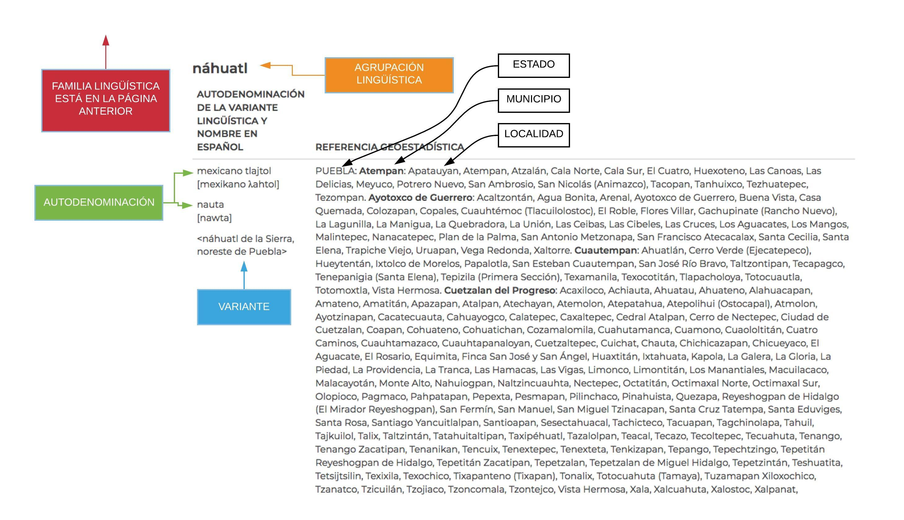

# BDCV_DFW_2020

#### **comparar datos que viene de la clasificación de los lenguas indígenas por INALI con el catálogo de la Biblioteca Daniel Cosío Villegas en El Colegio de México**
---

aquí encontramos los recursos relevantes de INALI: https://www.inali.gob.mx/clin-inali/

aquí se puede ver el catálogo de la Biblioteca Daniel Cosío Villegas (BDCV): https://biblioteca.colmex.mx/

un ejemplo del página de INALI donde quedan casi todos los datos que queremos sacar (menos la Familia Lingüística, que está en la página anterior)

